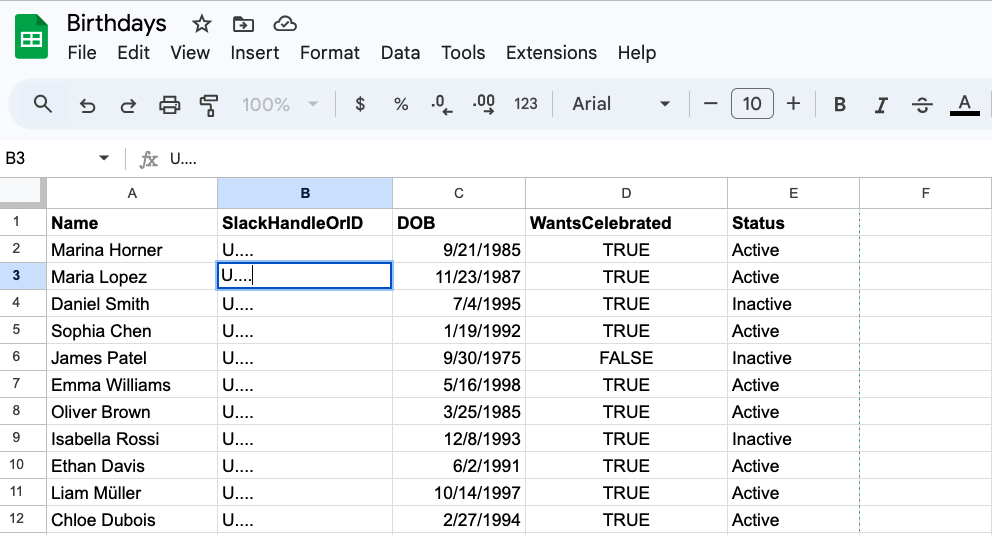
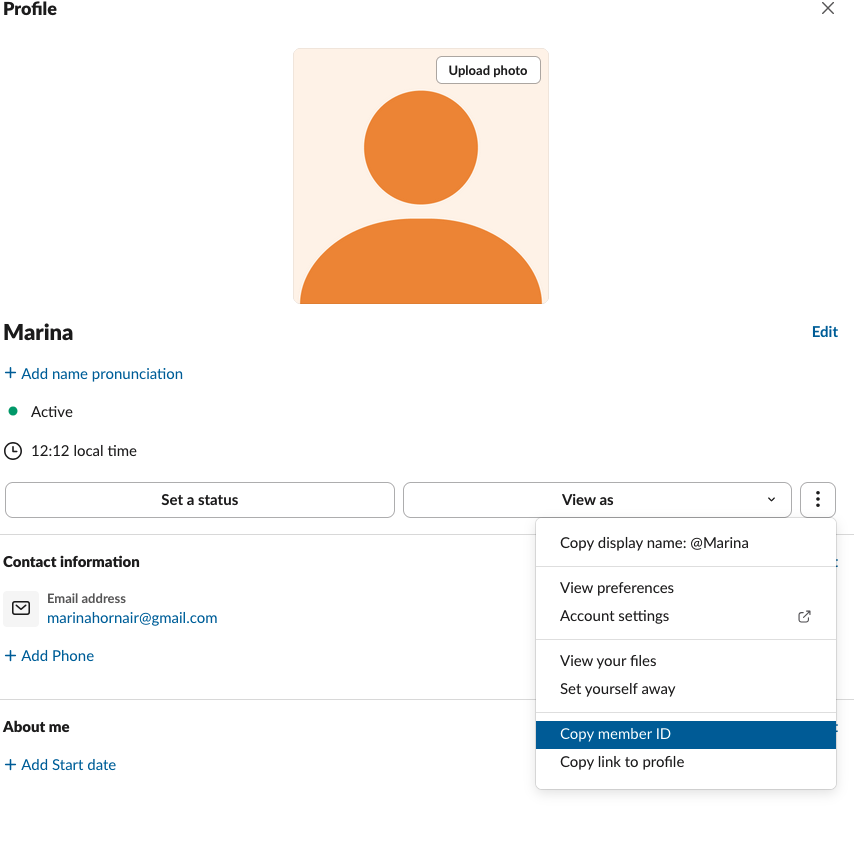
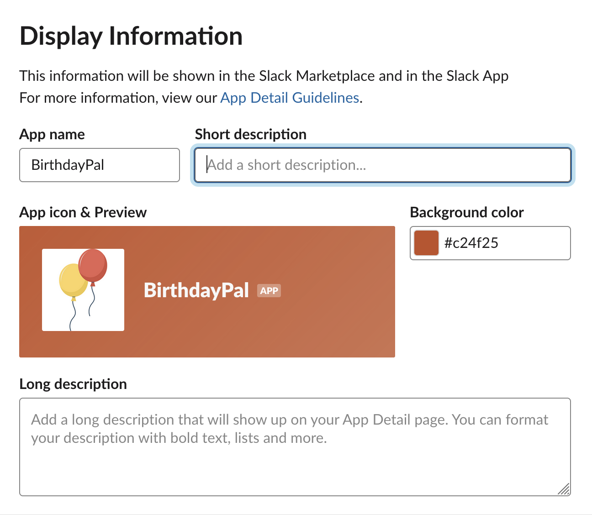
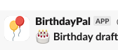
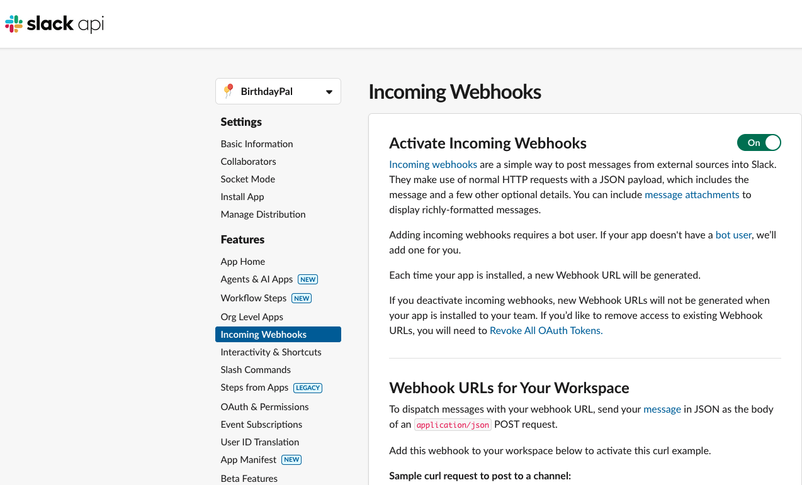
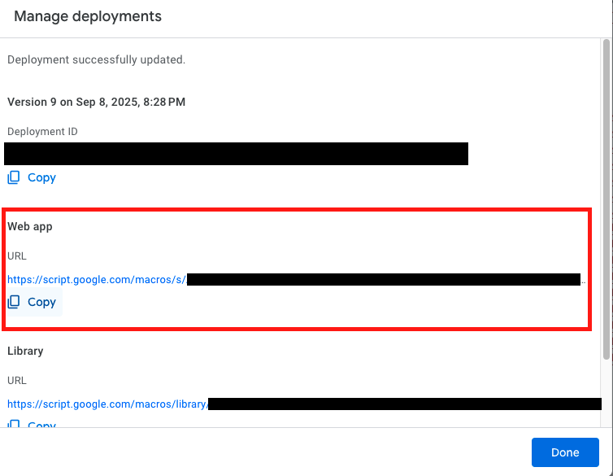
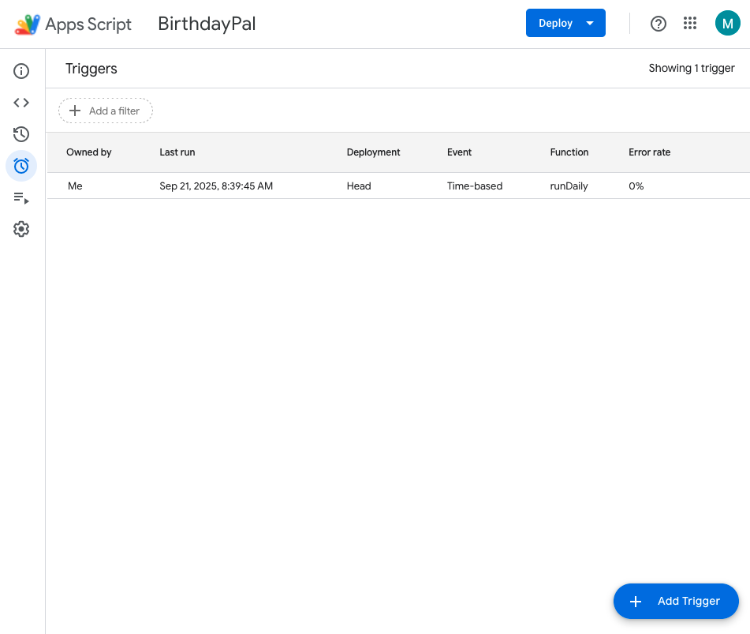

# Slack BirthdayBot

A lightweight, open-source birthday bot built with **Google Apps Script** and **Slack Incoming Webhooks**. No paid tools, no third-party bots — just the systems you already have.

Built by [Gonzalo Munoz](https://github.com/ITWASNOTG), who specialises in People Automation — using AI, automation, and practical experiments that turn ideas into impact.

---

## Why This Matters

People teams love acknowledging birthdays with fun Slack posts. It's exactly these small, human moments in the employee journey that shape how people experience your culture day to day.

Great... except:

- We do it painstakingly manually, writing every message ourselves (time sink).
- Or we lean on the HRIS for a bland automated reminder (no personality, no control).
- Or we buy yet another SaaS/Slack bot to reuse data we already have.

The risks:

- You waste time on low-leverage manual work.
- The content feels generic and transactional, with little control over message and tone.
- The HRIS doesn't let folks opt in or out; it's everyone or no one.
- There's no approval flow.

**You don't need a shiny new tool to fix this.** You can start with the systems you already have.

---

## Features

| Principle | How it works |
|---|---|
| **Automatic triggers** | Runs daily — no need to remember, the system will. |
| **Opt in / opt out** | People can choose whether their birthday is celebrated (`WantsCelebrated` column). |
| **Your tone of voice** | Write your own list of messages and GIFs to cycle through. |
| **Human-in-the-loop** | People Team approves, rejects, or regenerates each message before it posts. |
| **Action confirmation** | The People Team channel shows what action was taken — no duplicating effort. |
| **Weekend handling** | Birthdays on Saturday/Sunday are acknowledged on the Friday before. |

---

## Quick Start

### Prerequisites

- A Google account (Google Sheets + Apps Script — included free with Gmail/Workspace)
- A Slack workspace where you can create apps (admin access, or partner with IT)

### Step 1: Set Up the Spreadsheet

1. Create a new Google Sheet (or use an existing one).
2. Create a sheet tab named **`Birthdays`**.
3. Add these headers in row 1: `Name` | `SlackHandleOrID` | `DOB` | `WantsCelebrated` | `Status`
4. Fill in your team data.

> **Note:** The SlackID is not the same as the @username. It looks like `U08XXXXXXX`. You can find it in a person's Slack profile under **More > Copy member ID**.





### Step 2: Create a Slack App

1. Go to [api.slack.com/apps](https://api.slack.com/apps/)
2. Click **Create New App** > **From Scratch**
3. Name your app (e.g., `BirthdayPal`) and select your workspace
4. Under **Basic Information > Display Information**, personalise your app with colours, icons, and descriptions





### Step 3: Turn On Incoming Webhooks

1. In the app sidebar, go to **Incoming Webhooks** and toggle it **On**
2. Click **Add New Webhook to Workspace** and pick your **People Team channel**
3. Repeat to add a second webhook for your **company-wide channel**
4. Copy both webhook URLs (they look like `https://hooks.slack.com/services/...`)



> **What is a webhook?** It's a handover between two systems. Instead of checking every morning "any birthdays today?", Apps Script delivers the info straight to Slack when it's ready.

### Step 4: Set Up the Apps Script

1. In your Google Sheet, go to **Extensions > Apps Script**
2. Rename the project (e.g., `BirthdayPal`)
3. Delete any starter code and paste the contents of [`src/Code.gs`](src/Code.gs)
4. Fill in the config section at the top:

```javascript
const PEOPLE_TEAM_DRAFT_WEBHOOK = 'https://hooks.slack.com/services/...'; // your People Team channel
const COMPANY_CHANNEL_WEBHOOK   = 'https://hooks.slack.com/services/...'; // company-wide channel
const SHEET_NAME                = 'Birthdays';
const TIMEZONE                  = 'Europe/London'; // your timezone
```

Leave `WEB_APP_BASE_URL` empty for now — you'll get it after deploying.

### Step 5: Deploy as a Web App

1. Click **Deploy > New deployment > Web app**
2. Set **Execute as:** `Me`
3. Set **Who has access:** `Anyone within your organisation` (recommended) or `Anyone`
4. Click **Deploy** and copy the **Web App URL**
5. Paste it back into your code as the `WEB_APP_BASE_URL` value
6. **Save**, then **Deploy > Manage deployments > Edit > Deploy** to publish the update



> **Is my data safe?** The web app access setting controls who can open the Approve/Reject link. It does **not** give anyone access to your Sheet or a list of birthdays.

### Step 6: Authorise the Script

1. In the Apps Script toolbar, select a simple function from the dropdown (e.g., `pickGif`)
2. Click the **Run** button
3. A popup will ask for **Authorization required** — click **Review permissions**
4. Choose your Google account, review the permissions, and click **Allow**

### Step 7: Add the Daily Trigger

1. In the left sidebar, click **Triggers > + Add Trigger**
2. Function: `runDaily`
3. Deployment: `Head`
4. Event source: **Time-driven**
5. Type: **Day timer**, pick a time (e.g., 08:30)
6. **Save**



### Step 8: Test It

1. In your Sheet, add a test row with today's date as the DOB, `WantsCelebrated` = `TRUE`, and `Status` = `Active`
2. In Apps Script, run **`runDaily()`**
3. Check your People Team channel — you should see a draft with **Approve / Reject / Regenerate** buttons
4. Click **Approve** — the final message appears in the company channel

---

## Understanding the Script

### Config (you must edit)

Where you plug in your webhook URLs, sheet name, and timezone.

### GIFs (you should edit)

Your library of birthday GIFs. The script randomly picks one each time. Remove any you don't like, add your own from [giphy.com](https://giphy.com/) — just make sure the URL ends with `.gif`.

### Blurbs (you should edit)

Your library of birthday messages. The script cycles through them randomly and won't repeat until all have been used once. Edit the text to match your tone (formal, casual, funny — whatever fits your culture).

### Daily Collector (`runDaily`) — leave as is

Runs once per day. Checks today's date (and on Fridays also checks Saturday and Sunday). Looks at your sheet for active, opted-in matches. Creates a draft message and posts it to the People Team channel.

### Approval Endpoint (`doGet`) — leave as is

Each draft has buttons that link back to this endpoint. **Approve** sends the message to the company channel. **Reject** deletes it. **Regenerate** re-rolls the GIF and blurb and posts a new draft.

### Slack Posting — leave as is

Handles formatting and sending messages to Slack via webhooks.

### Blurb Cycling — leave as is

Ensures blurbs don't repeat until the full set has been used once. Keeps it fresh.

### Utilities — leave as is

Helper functions for reading rows, handling timezones, formatting dates, picking GIFs, and converting `Yes/No` to booleans.

---

## Ideas to Build On

This works well as an MVP, but there are plenty of ways to take it further:

- **AI-generated blurbs** — Integrate an LLM for personalised birthday messages each time.
- **Work anniversaries** — Same script, different date column, different blurbs.
- **New joiner shout-outs** — Auto-post a "Welcome!" message on Day 1.
- **Approval log** — Save actions into a second sheet tab as an audit trail.
- **Opt-in messages** — DM the person to ask if they'd like a shout-out this year.
- **Scheduled nudge** — If nobody approves/rejects within 24 hours, ping them with a reminder.
- **HRIS integration** — Pull birthdays directly from your HR system API.
- **Culture-aware copy** — Use location data to adapt message formality.
- **"On this day" trivia** — Add a fun fact about what happened historically on their birthday.
- **AI-selected GIFs** — Use the person's bio to pick a themed GIF.
- **Colleague shout-in** — Include recent peer kudos in the birthday post.
- **Sass slider** — Generate blurbs at different sass levels and let the People Team choose.

---

## License

[MIT](LICENSE) — free to use, modify, and share.

## Credits

Built by [Gonzalo Munoz](https://github.com/ITWASNOTG). Feel free to copy, adapt, or build on this for your own team. If you do, I'd love to hear what worked, what you changed, and what you added!
